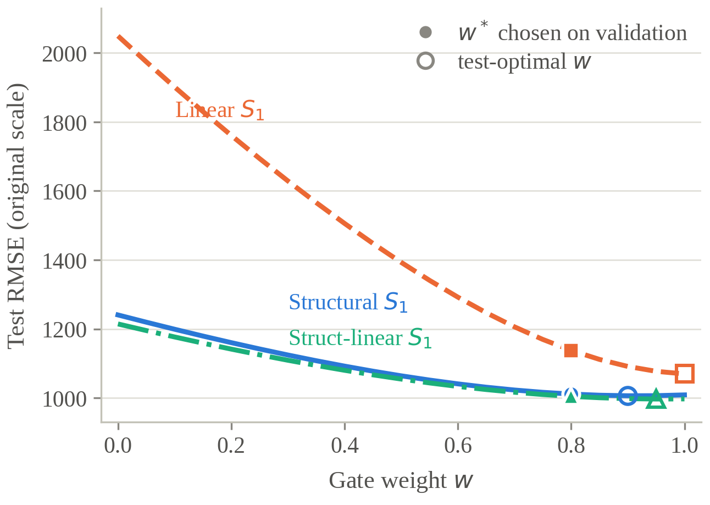
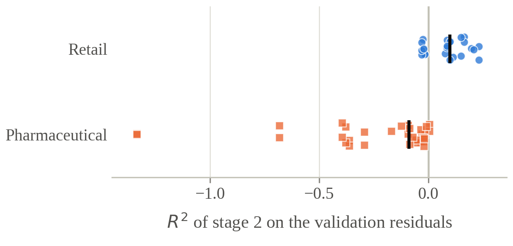
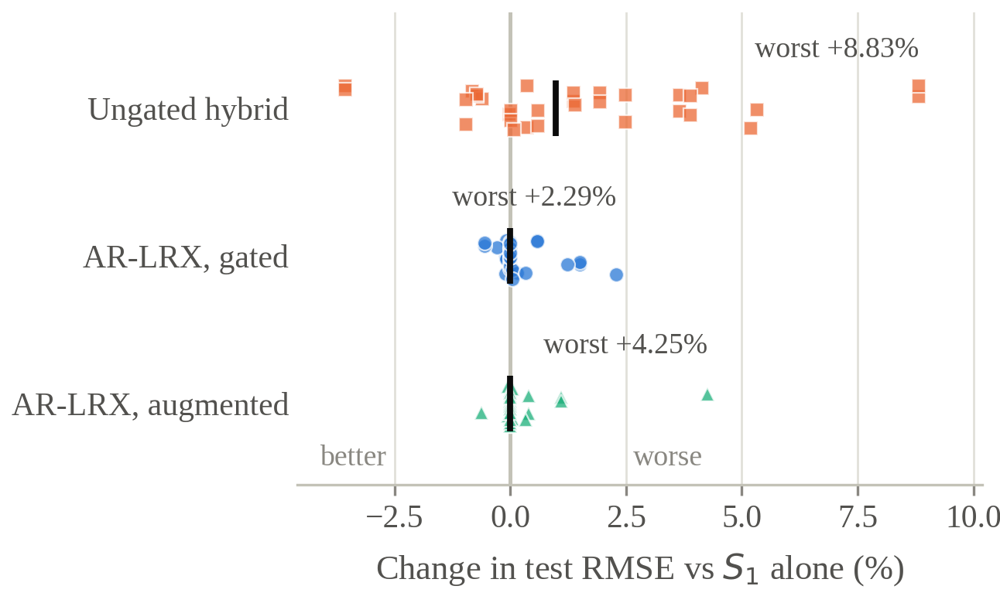
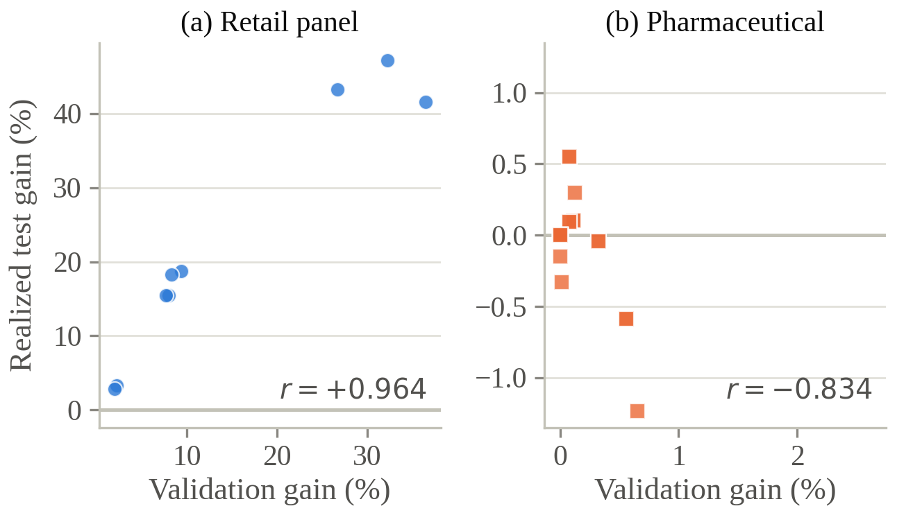

# AR-LRX — Adaptive Residual Linear Regression–XGBoost Forecasting

This repository implements **AR-LRX**, a residual hybrid of linear regression and XGBoost
whose residual correction is weighted by a gate selected on the validation fold, and the
protocol-controlled evaluation behind

> *AR-LRX: Robustness of Adaptive Residual Linear Regression–XGBoost Forecasting Across
> Pharmaceutical and Retail Demand Regimes.*

Every model in the study, including eight baselines drawn from published work, is trained
and evaluated under one experimental contract. Nothing is quoted from another paper.

## Repository Structure

**Top-level folders and files:**
- `assets/` — Architecture diagrams and summary visualizations
- `data/` — Raw datasets and data documentation
- `docs/` — Per-experiment notes: what each run established and what it closed
- `models/` — Saved model artifacts
- `notebooks/` — Experiment, benchmark and figure notebooks
- `paper/figures/` — The five figures of the manuscript, at publication resolution
- `results/` — Machine-readable result files, one set per experiment
- `src/` — Shared utility functions and helpers
- `tools/` — Determinism check used to verify C4
- `.gitignore`
- `README.md`
- `REPRODUCE.md` — Which notebook and which result file produces each table and figure
- `VISUALIZATION_PLAN.md`
- `pyproject.toml`
- `uv.lock`

## Overview

A residual hybrid predicts a series with a first stage, then trains a second stage on what
the first stage leaves behind. The earlier version of this project used ordinary least
squares as the first stage and XGBoost as the second, with the correction always applied
in full. AR-LRX generalises that design in two ways:

```
ŷ = S₁(x) + w · S₂(x ; y − S₁(x)),        w ∈ {0, 0.1, …, 1.0}
```

- **The first stage is chosen**, not fixed — linear, a hierarchical group-mean
  (`Store × DayOfWeek × Promo`, with backoff), or the two combined.
- **The correction is weighted** by a gate `w` selected jointly with the second-stage
  hyperparameters on the validation fold. Because `w = 0` lies in the search space,
  AR-LRX cannot be worse than its own first stage on that fold; with a linear first
  stage and `w = 1` it reproduces the earlier design exactly, verified to machine
  precision.

The study is built around a question the earlier work could not answer: *is residual
hybridization robust across demand regimes, and what does its robustness depend on?*
Two datasets were chosen to be opposites — a retail panel whose first-stage residuals
retain structure, and pharmaceutical series whose residuals do not.

## Main Experiments

| Notebook | What it establishes |
|---|---|
| `notebooks/exp05a_rossmann_arlrx.ipynb` | AR-LRX on the retail panel, three first stages × three feature sets |
| `notebooks/exp05b_rossmann_arlrx_audit.ipynb` | Reproduction check, DM tests on both scales, full ablation, gate curve, per-segment errors |
| `notebooks/exp05d_rossmann_arlrx_dev.ipynb` | Augmented and segmented gate variants |
| `notebooks/exp05c_pharma_arlrx.ipynb` | AR-LRX on 32 pharmaceutical configurations |
| `notebooks/exp06b_rossmann_baselines_strong.ipynb` | The eight baselines, retrained under the same contract |
| `notebooks/figures_paper.ipynb` | Figures 2–5, regenerated from `results/` in seconds |

`exp03_rossmann_leakage_ablation.ipynb` defines the three admissible Rossmann feature
configurations. `exp06_rossmann_baselines_unified.ipynb` is the first, weaker baseline
pass; it is kept so that the improvement reported in Section 3.3 of the paper can be
checked rather than taken on trust.

`docs/` carries a short note per experiment recording what that run established, what
objection it closes, and — where an earlier reading turned out to be wrong — what was
corrected and why.

## Benchmark Notebooks

Supporting notebooks reproduce the source studies whose models are retrained here —
Diamantini et al. (MLP, CNN, RNN, LSTM, Transformer), Qureshi et al. (GRU), Zeng et al.
(LightGBM), Zhaoweijie et al. (XGBoost) on Rossmann, and Zdravković, Fourkiotis and
Rathipriya on PharmaSales.

## Setup Requirements

`uv` package manager, Jupyter, and core dependencies: scikit-learn, xgboost, lightgbm,
tensorflow, prophet, statsmodels, pmdarima. Everything runs on CPU; a GPU is not required
and, on native Windows, not available to TensorFlow ≥2.11.

`pyproject.toml` declares `requires-python = ">=3.12"`, but the results reported in the
paper were produced on **Python 3.10.11** with the versions listed in
[REPRODUCE.md](REPRODUCE.md). If you intend the lockfile to describe the environment the
paper was run in, relax that constraint before publishing the repository.

## Datasets

- **PharmaSales:** Daily and weekly ATC-category sales (8 categories: M01AB, M01AE, N02BA,
  N02BE, N05B, N05C, R03, R06) — 2,106 daily and 302 weekly observations
- **Rossmann:** Store-level daily sales with promotional and holiday features — 838,760
  store-days across 1,115 stores, split 589,839 / 119,588 / 129,333 by time

The Rossmann `Customers` column is **not** used contemporaneously. It is absent from the
competition test file and unknown at forecast time, so three admissible configurations are
defined instead: `V1` drops it, `V2` lags it, `V3` uses lagged sales. `V3` is the primary
configuration because it matches the information a planner actually holds.

## The Experimental Contract

| | Rule |
|---|---|
| C1 | Chronological 70/15/15 split |
| C2 | Hyperparameters selected on validation only |
| C3 | Refit on training + validation, then one untouched evaluation on test |
| C4 | Seed 42; tree-based results verified bit-identical across runs |
| C5 | Lag count chosen from the PACF of the training block alone |
| C6 | Every fitted statistic estimated on the active fitting block |
| C7 | Every experiment writes metrics, hyperparameters, split boundaries and an environment stamp |

## Key Results Summary

Rossmann `V3`, original scale, single held-out block (13 Mar – 31 Jul 2015):

| Rank | Model | Source | RMSE | MAE | RMSPE | R² |
|---|---|---|---|---|---|---|
| 1 | **AR-LRX**, augmented, structural S₁ | this work | **945.42** | 645.64 | 0.1200 | **0.9084** |
| 2 | AR-LRX, augmented, struct-linear S₁ | this work | 956.27 | 652.97 | 0.1213 | 0.9063 |
| 3 | AR-LRX, gated, struct-linear S₁ | this work | 1004.69 | 690.89 | 0.1273 | 0.8966 |
| 4 | XGBoost | Zhaoweijie et al. | 1014.27 | 692.14 | 0.1323 | 0.8946 |
| 5 | LightGBM | Zeng et al. | 1015.73 | 697.14 | 0.1324 | 0.8943 |
| 7 | Residual hybrid, ungated | earlier study | 1058.82 | 704.84 | 0.1341 | 0.8851 |
| 12 | Seasonal naive | — | 1274.63 | 850.47 | 0.1570 | 0.8335 |

No retrained baseline outperforms AR-LRX. All eight Diebold–Mariano comparisons favour it
and are significant at the 5% level **on both the log and the original scale**, with the
sign agreeing across scales.

PharmaSales, 32 configurations:

| Framework | Worse than S₁ | Mean change | Worst case |
|---|---|---|---|
| Ungated residual hybrid | 23 of 32 | +1.575% | +8.828% |
| **AR-LRX, gated** | **10 of 32** | **+0.202%** | **+2.287%** |
| AR-LRX, gated and augmented | 8 of 32 | +0.216% | +4.255% |

> **On the earlier figures.** A previous version of this README reported Rossmann
> RMSE = 577.63, R² = 0.9651. That configuration used `Customers` contemporaneously and
> therefore does not describe a forecasting task; it is superseded by the numbers above.
> Errors also move in *both* directions when the published baselines are retrained under
> one contract — LightGBM improves by 40.5%, CNN worsens by 66.2% — which is why the
> comparison in this study is restricted to models retrained here.

## Figures

**Figure 2 — how much does the gate weight matter?** With a linear first stage the curve
falls steeply throughout, so any shrinkage is costly; with a structural first stage it is
nearly flat above `w = 0.6`, which is why the gate buys almost no accuracy in this regime.



**Figure 3 — the regime diagnostic.** The R² of the second stage on the *validation*
residuals separates the two regimes before any test observation is used. The separation is
not perfect, and the exceptions are shown rather than hidden.



**Figure 4 — what the gate buys.** Gating does not shift the whole distribution; it removes
the ungated framework's long right tail. This is a robustness property, not an accuracy one.



**Figure 5 — a diagnostic that does not generalise.** The validation-fold indicator predicts
the realised test gain on the retail panel (r = +0.964) and reverses on the pharmaceutical
series (r = −0.834). Reported as a negative result about our own diagnostic.



All four are regenerated by `notebooks/figures_paper.ipynb` from `results/` alone — no model
is retrained, so the figures cannot drift from the reported numbers.

## Performance Context

The decisive factor is the alignment of the first stage with the structure of the data,
not the capacity of the second stage. Replacing a linear first stage with a hierarchical
estimator turned a hybrid that was *worse* than plain gradient boosting (1058.82 vs 1017.83)
into one that beats every retrained baseline (945.42). The gate contributes little accuracy
where correction is warranted and prevents substantial degradation where it is not — on
PharmaSales it closes completely in 15 of 32 configurations, reducing AR-LRX to ordinary
linear regression, which on those series is the correct thing to do.

## Reproduction

See **[REPRODUCE.md](REPRODUCE.md)** for the run order, the mapping from every paper table
and figure to the notebook and result file that produces it, a glossary of the result-file
columns, and the environment.
