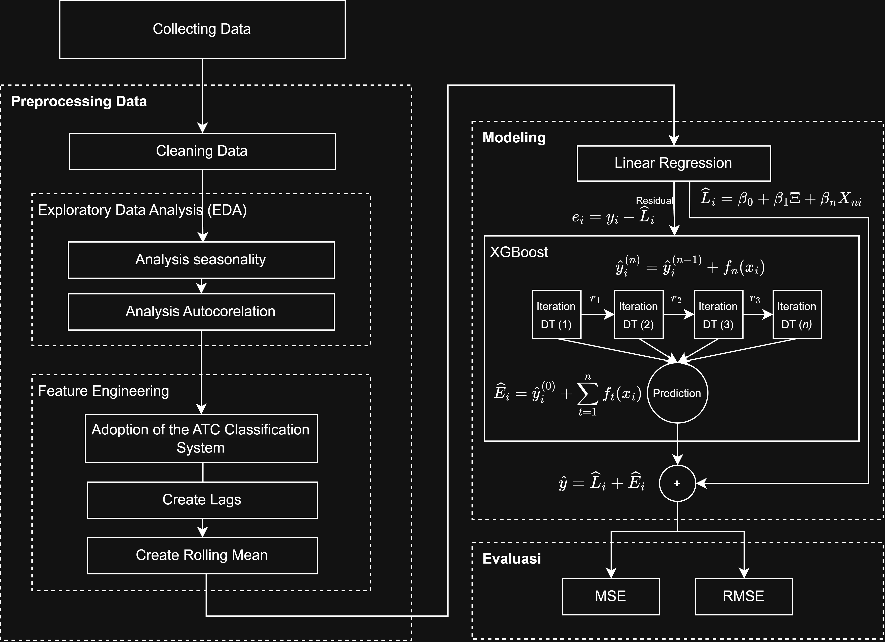
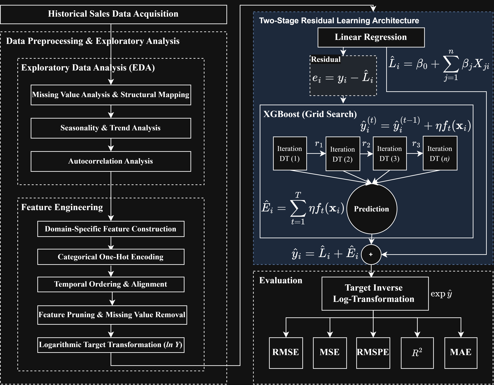
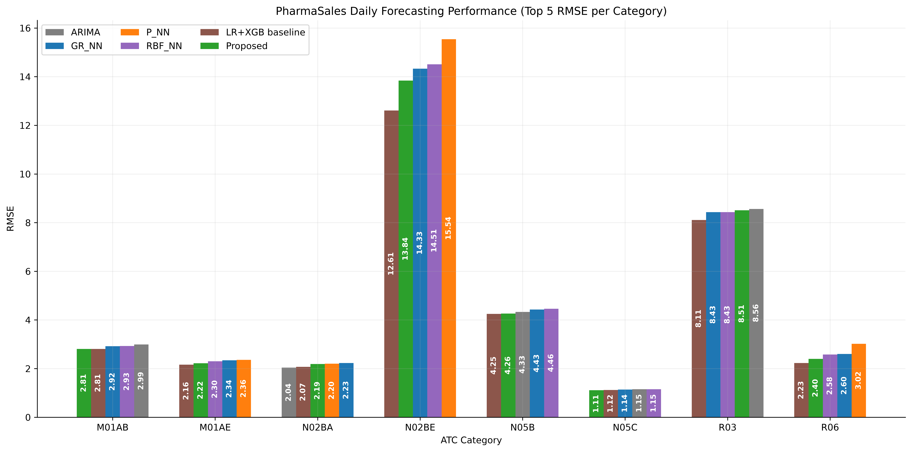
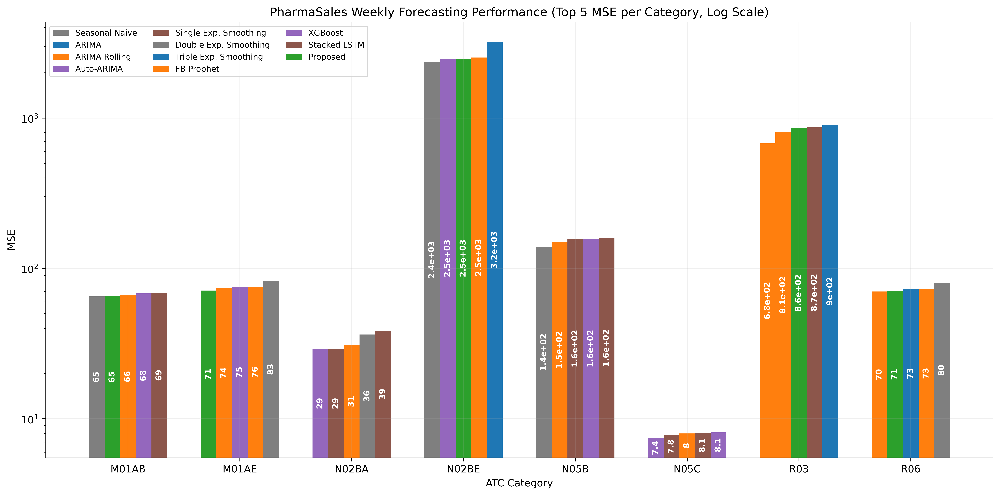
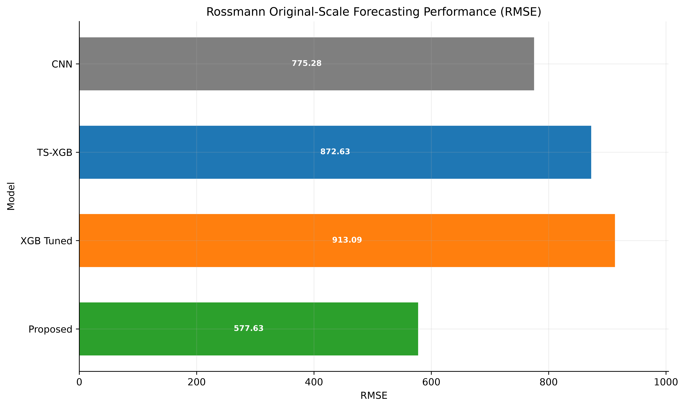
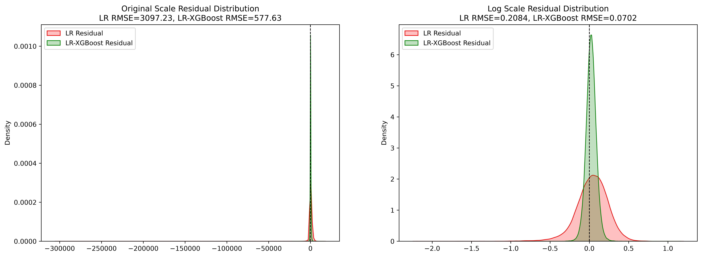
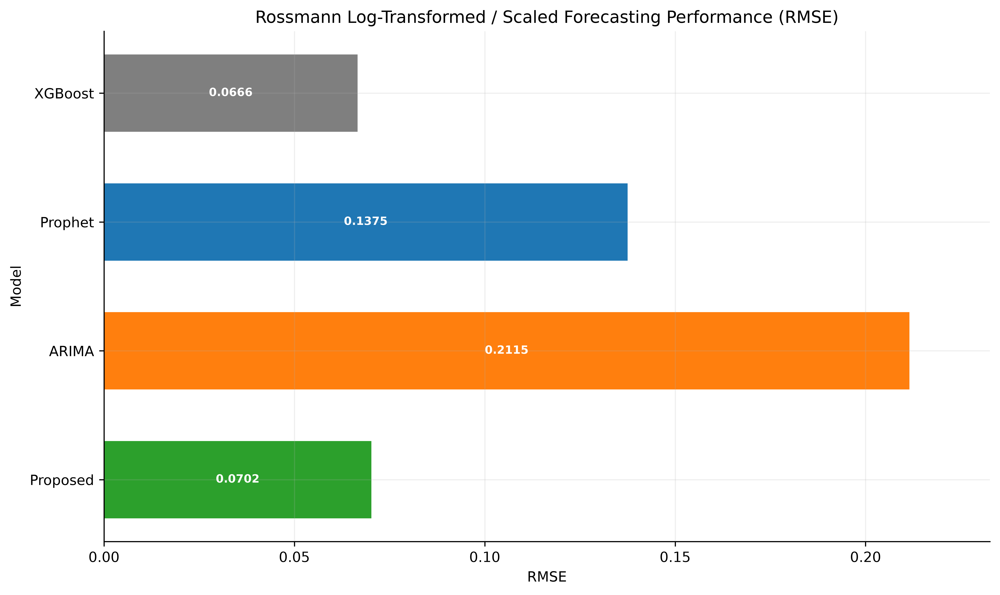

# Hybrid Residual Forecasting for PharmaSales and Rossmann Sales

Hybrid residual forecasting experiments for pharmaceutical demand and retail sales prediction.

This repository focuses on the proposed `LR-XGBoost (Residual)` approach: a linear model estimates the main trend, then XGBoost learns the remaining residual error. The main study is implemented in the Our Study notebooks for PharmaSales and Rossmann.

----------

## Overview

The project compares the proposed hybrid residual model against statistical, machine learning, and deep learning baselines reproduced from related forecasting studies.

Main datasets:
- PharmaSales daily and weekly ATC-category sales.
- Rossmann Store Sales daily retail data.

Main proposed method:
- Fit Linear Regression on engineered time-series features.
- Compute residuals between true sales and linear predictions.
- Train XGBoost on residuals.
- Combine both components as final forecast.

## Main Experiments

The main research notebooks are:

| Notebook | Dataset | Forecasting Target | Role |
|---|---|---|---|
| `notebooks/our_study_pharma_daily.ipynb` | PharmaSales | Daily ATC-category sales | Proposed daily medicine forecasting |
| `notebooks/our_study_pharma_weekly.ipynb` | PharmaSales | Weekly ATC-category sales | Proposed weekly medicine forecasting |
| `notebooks/our_study_rosman.ipynb` | Rossmann | Daily store sales | Proposed Rossmann residual forecasting |

## Benchmark Reproduction Notebooks

Supporting notebooks reproduce or adapt baseline studies for comparison.

| Notebook | Dataset | Reference Role |
|---|---|---|
| `notebooks/rathipriya_pharma_daily.ipynb` | PharmaSales daily | Statistical and neural baselines |
| `notebooks/ramadhan_pharma_daily.ipynb` | PharmaSales daily | LR-XGBoost baseline |
| `notebooks/fourkiotis_pharma_weekly.ipynb` | PharmaSales weekly | Statistical and XGBoost baselines |
| `notebooks/zdravkovic_pharma_weekly.ipynb` | PharmaSales weekly | ARIMA, Auto-ARIMA, Prophet, LSTM baselines |
| `notebooks/diamantini_2024_rossmann.ipynb` | Rossmann | Deep learning baselines |
| `notebooks/qureshi_rossmann_daily.ipynb` | Rossmann | LSTM and GRU baselines |
| `notebooks/zeng_rossmann_daily.ipynb` | Rossmann | XGBoost, LightGBM, TS-XGBoost, TS-LGBM baselines |
| `notebooks/zhaoweijie_rossmann_daily.ipynb` | Rossmann | XGBoost tuning baselines |
| `notebooks/malik_rossmann_daily.ipynb` | Rossmann | ARIMA, Prophet, XGBoost scaled baselines |

## Prerequisite

- Python `>=3.12`
- `uv`
- Jupyter Notebook or JupyterLab
- Core ML dependencies from `pyproject.toml`: `scikit-learn`, `xgboost`, `lightgbm`, `tensorflow`, `prophet`, `statsmodels`, `pmdarima`

## Setup

```bash
# Install dependencies
uv sync

# Register Jupyter kernel
uv run ipython kernel install --user --name=forecasting-medicine --display-name="Python 3.12 (forecasting-medicine)"
```

## Usage

```bash
# Launch Jupyter
uv run jupyter lab
# or
uv run jupyter notebook
```

Run the main study notebooks first, then run the benchmark notebooks only when refreshing comparison tables.

## Data

Expected raw data paths:

| Dataset | Files |
|---|---|
| PharmaSales | `data/raw/pharma-sales/salesdaily.csv`, `data/raw/pharma-sales/salesweekly.csv` |
| Rossmann | `data/raw/rossmann/train.csv`, `data/raw/rossmann/store.csv`, `data/raw/rossmann/test.csv` |

## Proposed Method

`LR-XGBoost (Residual)` uses a two-stage residual correction design.

1. Linear Regression learns the first-order relationship between engineered time features and sales.
2. Residuals are computed as `actual - linear_prediction`.
3. XGBoost learns the residual pattern.
4. Final prediction is `linear_prediction + xgboost_residual_prediction`.

For Rossmann, experiments include log-transformed targets and inverse transformation back to original sales scale.

### Experiment Architecture

#### PharmaSales Daily and Weekly

The PharmaSales daily and weekly experiments use the same architecture, with different time aggregation levels.



Pipeline summary:

1. Load the PharmaSales daily or weekly dataset.
2. Select ATC sales categories: `M01AB`, `M01AE`, `N02BA`, `N02BE`, `N05B`, `N05C`, `R03`, `R06`.
3. Apply preprocessing and time-series feature engineering.
4. Train Linear Regression as the first-stage model.
5. Compute residuals as `actual - linear_prediction`.
6. Tune XGBoost hyperparameters using Grid Search, Optuna, PSO, and GEO.
7. Train XGBoost on Linear Regression residuals.
8. Produce the final forecast using `linear_prediction + xgboost_residual_prediction`.
9. Evaluate using RMSE or MSE and residual distribution analysis.

#### Rossmann

Rossmann follows the same residual correction principle, but uses Rossmann-specific retail features and log-transformed sales.



Pipeline summary:

1. Load Rossmann `train.csv` and merge store-level metadata from `store.csv`.
2. Sort observations by `Date` and use an 80:20 chronological train-test split.
3. Create retail promotion features, including `IsPromo2Active` and `Promo2DurationWeeks`.
4. One-hot encode categorical store and holiday features.
5. Remove unused or redundant columns and prepare the final feature matrix.
6. Apply `log1p` transformation to `Sales` for the main proposed experiment.
7. Train Linear Regression as the first-stage model on transformed sales.
8. Compute residuals as `actual_log_sales - linear_prediction`.
9. Tune XGBoost with Grid Search and TimeSeriesSplit, then train XGBoost on the residuals.
10. Produce final log-scale forecasts using `linear_prediction + xgboost_residual_prediction`.
11. Convert predictions back to original sales scale using `expm1` and evaluate using RMSE, MSE, RMSPE, `R^2`, and MAE.

## Results

### Key Findings

| Dataset | Proposed Method | Main Metric Snapshot |
|---|---|---|
| PharmaSales daily | `LR-XGBoost (Residual)` | Competitive RMSE across all ATC categories |
| PharmaSales weekly | `LR-XGBoost (Residual)` | Low MSE across weekly ATC categories under the proposed pipeline |
| Rossmann original scale | `LR-XGBoost (Residual)` | `RMSE=577.63`, `MSE=333,659.51`, `RMSPE=0.06840`, `R^2=0.9651`, `MAE=376.12` |
| Rossmann log-transformed table | `LR-XGBoost (Residual)` | `RMSE=0.07022`, `MSE=0.00493`, `R^2=0.97238`, `MAE=0.05373` |

The summary and residual visualizations are placed directly under each result table below.

### Table 1. Daily Forecasting Performance (RMSE) Across ATC Categories on PharmaSales Dataset

| Method / Architecture | M01AB | M01AE | N02BA | N02BE | N05B | N05C | R03 | R06 |
|---|---:|---:|---:|---:|---:|---:|---:|---:|
| **Statistical Baselines** |  |  |  |  |  |  |  |  |
| ARIMA (Rathipriya et al.) | 2.99 | 2.49 | 2.04 | 17.31 | 4.33 | 1.15 | 8.56 | 3.27 |
| **Machine Learning Baselines** |  |  |  |  |  |  |  |  |
| GR_NN (Rathipriya et al.) | 2.92 | 2.34 | 2.23 | 14.33 | 4.43 | 1.14 | 8.43 | 2.60 |
| P_NN (Rathipriya et al.) | 3.18 | 2.36 | 2.20 | 15.54 | 6.16 | 1.27 | 10.27 | 3.02 |
| RBF_NN (Rathipriya et al.) | 2.93 | 2.30 | 2.24 | 14.51 | 4.46 | 1.15 | 8.43 | 2.58 |
| LR+XGB (Ramadhan et al.) | 2.81 | 2.16 | 2.07 | 12.61 | 4.25 | 1.12 | 8.11 | 2.23 |
| **Proposed Method** |  |  |  |  |  |  |  |  |
| LR-XGBoost (Residual) | 2.81 | 2.22 | 2.19 | 13.84 | 4.26 | 1.11 | 8.51 | 2.40 |



This visualization compares the top 5 lowest daily RMSE methods for each ATC category. Lower bars indicate better forecasting performance, and the proposed method is highlighted to show where residual correction is competitive against statistical and machine learning baselines.


The daily residual distribution is used to check whether the proposed model reduces the remaining error after Linear Regression. A better residual correction is indicated when the LR-XGBoost residual curve is more concentrated around zero and has a narrower spread than the Linear Regression residual curve.

### Table 2. Weekly Forecasting Performance (MSE) Across ATC Categories on PharmaSales Dataset

| Method / Architecture | M01AB | M01AE | N02BA | N02BE | N05B | N05C | R03 | R06 |
|---|---:|---:|---:|---:|---:|---:|---:|---:|
| **Statistical Baselines** |  |  |  |  |  |  |  |  |
| Seasonal Naive (Fourkiotis et al. [10]) | 72.13 | 82.64 | 73.25 | 2357.23 | 211.76 | 11.11 | 1024.35 | 80.34 |
| ARIMA (Zdravkovic et al. [7]) | 80.17 | 86.96 | 50.86 | 6888.53 | 160.47 | 8.33 | 1361.48 | 117.72 |
| ARIMA Rolling Forecast (Fourkiotis et al. [10]) | 66.08 | 74.14 | 30.97 | 2525.41 | 149.74 | 7.99 | 677.92 | 70.25 |
| Auto-ARIMA (Zdravkovic et al. [7]) | 68.95 | 86.47 | 29.03 | 6834.85 | 156.12 | 8.12 | 2287.68 | 120.88 |
| Single Exp. Smoothing (Fourkiotis et al. [10]) | 68.84 | 86.51 | 29.03 | 11483.95 | 156.09 | 8.06 | 2279.65 | 151.60 |
| Double Exp. Smoothing (Fourkiotis et al. [10]) | 65.15 | 87.30 | 36.36 | 12352.55 | 139.13 | 8.70 | 2362.09 | 159.27 |
| Triple Exp. Smoothing (Fourkiotis et al. [10]) | 75.91 | 86.19 | 45.28 | 3197.90 | 243.99 | 9.28 | 901.63 | 72.71 |
| **Machine Learning Baselines** |  |  |  |  |  |  |  |  |
| FB Prophet (Zdravkovic et al. [7]) | 89.19 | 75.67 | 44.03 | 3541.74 | 248.06 | 10.09 | 807.72 | 73.03 |
| XGBoost (Fourkiotis et al. [10]) | 68.22 | 75.45 | 66.88 | 2470.51 | 178.77 | 7.44 | 993.66 | 83.97 |
| Stacked LSTM (Zdravkovic et al. [7]) | 76.29 | 93.25 | 38.54 | 4145.11 | 158.71 | 7.77 | 866.70 | 94.91 |
| **Proposed Method** |  |  |  |  |  |  |  |  |
| LR-XGBoost (Residual) | 65.2072 | 71.1793 | 67.7600 | 2472.6989 | 175.9400 | 8.1876 | 857.4368 | 70.8699 |

Note: Table 2 values use saved notebook outputs from the Our Preprocessing sections in `notebooks/fourkiotis_pharma_weekly.ipynb`, `notebooks/zdravkovic_pharma_weekly.ipynb`, and `notebooks/our_study_pharma_weekly.ipynb`.



This visualization compares the top 5 lowest weekly MSE methods for each ATC category on a log scale. The log scale is used because baseline errors vary widely across categories, making it easier to compare the proposed method against larger-error baselines.


The weekly residual distribution summarizes how well the proposed model handles aggregated weekly demand patterns. A tighter LR-XGBoost residual distribution around zero suggests that residual correction improves weekly forecast stability compared with Linear Regression alone.

### Table 3. Predictive Performance Comparison on Rossmann Store Sales Dataset (Original Scale)

| Method / Architecture | Reference | Target Scale During Training | RMSE | MSE | RMSPE | R^2 | MAE |
|---|---|---|---:|---:|---:|---:|---:|
| **Deep Learning Baselines** |  |  |  |  |  |  |  |
| Transformer | Diamantini et al. [55] | Original / Inverse | 881.28 | 776,654.00 | 0.10442 | 0.9172 | 577.50 |
| LSTM | Diamantini et al. [55] | Original / Inverse | 1,150.89 | 1,324,554.00 | 0.15591 | 0.8588 | 806.58 |
| MLP | Diamantini et al. [55] | Original / Inverse | 825.32 | 681,147.30 | 0.10858 | 0.9274 | 537.33 |
| RNN | Diamantini et al. [55] | Original / Inverse | 1,044.78 | 1,091,573.00 | 0.13683 | 0.8837 | 722.02 |
| CNN | Diamantini et al. [55] | Original / Inverse | 775.28 | 601,055.60 | 0.10037 | 0.9359 | 512.57 |
| LSTM + Grid Search | Qureshi et al. [56] | Original / Inverse | 1,410.69 | 1,990,056.50 | 0.23629 | 0.7938 | 1,012.78 |
| GRU + Grid Search | Qureshi et al. [56] | Original / Inverse | 1,266.04 | 1,602,845.38 | 0.22955 | 0.8339 | 924.49 |
| **Machine Learning Baselines** |  |  |  |  |  |  |  |
| XGBoost (Rossmann) | Zeng et al. [57] | Original / Inverse | 1,801.78 | 3,246,403.50 | 0.3578 | 0.7704 | 1,287.30 |
| LightGBM (Rossmann) | Zeng et al. [57] | Original / Inverse | 1,706.33 | 2,911,546.91 | 0.3489 | 0.7941 | 1,232.47 |
| TS-XGBoost | Zeng et al. [57] | Original / Inverse | 872.63 | 761,485.31 | 0.1432 | 0.9342 | 570.52 |
| TS-LGBM | Zeng et al. [57] | Original / Inverse | 885.53 | 784,170.32 | 0.1490 | 0.9322 | 581.80 |
| XGBoost (Baseline) | Zhao et al. [58] | Original / Inverse | 1,142.49 | 1,305,294.62 | 0.15995 | 0.8633 | 797.19 |
| XGBoost (Tuned v1) | Zhao et al. [58] | Original / Inverse | 913.09 | 833,736.38 | 0.14691 | 0.9030 | 621.59 |
| **Proposed Method** |  |  |  |  |  |  |  |
| LR-XGBoost (Residual) | Our Study | Original / Inverse | 577.63 | 333,659.51 | 0.06840 | 0.9651 | 376.12 |

Note: Diamantini, Zeng, and Zhao rows use rerun notebook outputs after adding full metric exports. Qureshi rows use `Our Preprocessing` results from `notebooks/qureshi_rossmann_daily.ipynb`. Zhao et al. report a final validation error / `eval-rmse` around `0.07285`, but it is not listed as a Table 3 row because the table uses original-scale regression metrics plus RMSPE from reproduced predictions.



This visualization compares the top 10 Rossmann models from Table 3 after predictions are evaluated on the original sales scale. Lower RMSE indicates better real-scale forecasting accuracy, and the proposed residual model shows the strongest original-scale performance among the listed methods.



The Rossmann residual distribution evaluates residual correction on retail sales data. When the LR-XGBoost residuals are closer to zero with fewer large deviations, the hybrid model better captures nonlinear sales effects that remain after the linear component.

### Table 4. Predictive Performance Comparison on Rossmann Store Sales Dataset (Log-Transformed Target)

| Method / Architecture | Reference | Target Transform | RMSE | MSE | R^2 | MAE |
|---|---|---|---:|---:|---:|---:|
| **Log-Transformed Adaptation** |  |  |  |  |  |  |
| XGBoost | Malik et al. adaptation | `log1p(Sales)` | 0.4437 | 0.1969 | 0.8847 | 0.1834 |
| FB Prophet | Malik et al. adaptation | `log1p(Sales)` | 0.5874 | 0.3451 | 0.7979 | 0.3340 |
| ARIMA | Malik et al. adaptation | `log1p(Sales)` | 1.3094 | 1.7146 | -0.0045 | 1.0269 |
| **Proposed Method** |  |  |  |  |  |  |
| LR-XGBoost (Residual) | Our Study | `log1p(Sales)` | 0.07022 | 0.00493 | 0.97238 | 0.05373 |

Note: The three baseline rows are log-transformed adaptations implemented in `notebooks/malik_rossmann_daily.ipynb`; the paper does not specify MinMaxScaler or log transformation explicitly. Proposed method values use the `v1.5` transformed-sales test-load output from `notebooks/our_study_rosman.ipynb`.



This visualization compares all Rossmann log-transformed RMSE rows from Table 4. It shows how the proposed method performs under the transformed target setting used during training, alongside the log-transformed baseline adaptations.

## Repository Structure

```text
data/       Raw datasets and data notes
models/     Saved model artifacts
notebooks/  Main experiments and benchmark reproductions
src/        Shared utilities and model helpers
```

## Reproducibility Notes

- Result tables are compiled from saved notebook outputs.
- Our Study notebooks are the primary source for proposed-method rows.
- Benchmark notebooks are used only for comparative rows.
- Table values are filled where the rerun notebooks expose matching saved outputs for the exact table row.

## Acknowledgments

This project uses PharmaSales and Rossmann Store Sales datasets and compares against reproduced baselines from related forecasting literature.
